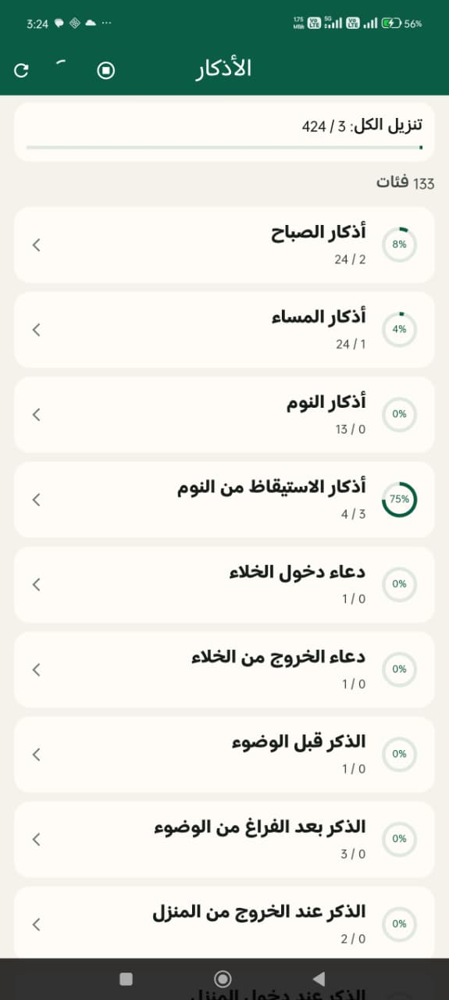
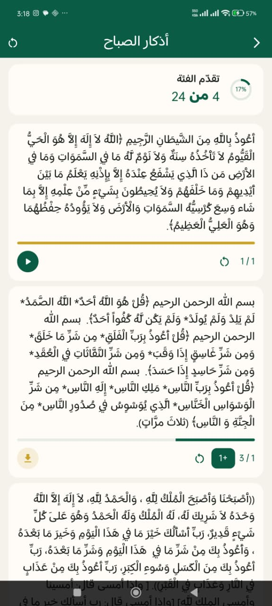
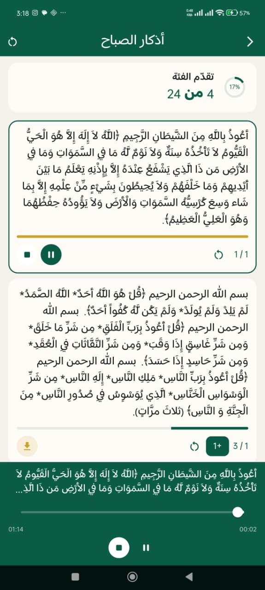

---

## Introduction 🚀
This package allow you to display, download and play Azkar on your app in the most simple way.

---

## Features ✨
- Load Azkar as categories (Sabah, Masaa, After Salah…). 📂
- Track & increment Zekr progress. ✅
- Auto-reset Sabah & Masaa Azkar based on user timezone. 🔄
- Download single or all Azkar audio files with progress. 🔈
- Full audio playback (play, pause, resume, seek, stop). 🎵
- Unified error handling via `AzkaryException` ⚠️

---

## Installation ⬇️

1. Add **`azkary`** to your app’s `pubspec.yaml` dependencies.
```yaml
azkary: 0.0.1
```

2. Initialize the package

```dart
// import package ✅
package:azkary/azkary.dart

WidgetsFlutterBinding.ensureInitialized();

// initalize package ✅
await Azkary.initialize();

runApp(const MyApp());
```

---

## Handling Azkar 🤲
#### NOTE: Sabah & Masaa Azkar are auto reseted acording to user timezone so user can start azkar sabah and close app then comes again to continue (unless the time of sabah azkar is passed it will be auto reseted).
```dart
/// load azkar categories (which hold the azkar inside of them)
/// ex: Azkar of sabah, massa, after salah...etc
Azkary.instance.getCategories();

/// increment the progress of zekr by one (+1)
/// ex: zekr must be said (3) times this will keep
/// increasing progress until we reach 3
Azkary.instance.incrementZekr();

/// reset zekr progress 
Azkary.instance.resetZekr(categoryId,zekrId);

/// reset all azkars inside the category 
Azkary.instance.resetCategory(categoryId,zekrId);
```

---

## Azkar Structure 🧡

Categories and azkar are loaded from `assets/json/azkar.json`. Field names below match `ZekrCategoryModel.fromJson` and `ZekrModel.fromJson`.

#### Category
```json
{
  "id": 1,
  "category": "أذكار الصباح",
  "type": "sabah",
  "azkar": [
    // azkar
  ]
}
```

#### Zekr
```json
{
  "id": 1,
  "text": "أَعُوذُ بِاللَّهِ مِنَ الشَّيطَانِ الرَّجِيمِ …",
  "count": 1,
  "audio": "audio.mp3",
  "filename": "name"
}
```

---

### Downloading Azkar Audio 🔈
```dart
/// download single zekr
Azkary.instance.downloadZekrAudio(
  categoryId,
  zekrId,
  onProgress(downloadProgress){
    var total = downloadProgress.total;
    var received = downloadProgress.received;
  }
);

/// download all the azkar audios once
Azkary.instance.downloadAllAudios(
    onProgress(downloadProgress){
        var completedItems = downloadProgress.completedItems;
        var totalItems = downloadProgress.totalItems;
        var currentFileProgress = downloadProgress.currentFileProgress;
        // for easier ui handling (calculated progress percentage)
        var overallPercent = downloadProgress.overallPercent;
    }
);

/// check if zekr audio already downloaded
Azkary.instance.isZekrAudioDownloaded();

/// cancel downloading of single zekr
Azkary.instance.cancelZekrDownload(categoryId, zekrId);

/// cancel downloading all azkar
Azkary.instance.cancelAllDownloads();
```

---

### Play Zekr Audio 🚀
```dart
/// play zekr
Azkary.instance.playZekrAudio(categoryId, zekrId);

/// pause zekr
Azkary.instance.pauseAudio();

/// resume
Azkary.instance.resumeAudio();

/// stop audio
Azkary.instance.stopAudio();

/// move forward or backward using slider
Azkary.instance.seek(Duration(minute: 1));
```

---

### Clean up ✨
```dart
// this will clean the streams, players and all other things related to package.
// be careful: if you used this function you need to re-intiialize the package again.
Azkary.instance.dispose();
```

---

### Handling Errors ✅
```dart
try{
  // any azkary operation
} on AzkaryException catch (error){
  // error will have detailed error message
}
```

---

## Always Remember Them! 🇵🇸
This package is an act of ongoing charity on behalf of the martyrs of Palestine.

---

## Author 🍁
[Github](https://github.com/EmadBeltaje) | [Linked-in](https://www.linkedin.com/in/emadbeltaje/)

## Screenshots from example app 📸
| Screenshot 1                                            | Screenshot 2 | Screenshot 3                                           |
|---------------------------------------------------------|---|--------------------------------------------------------|
|  |  |  |